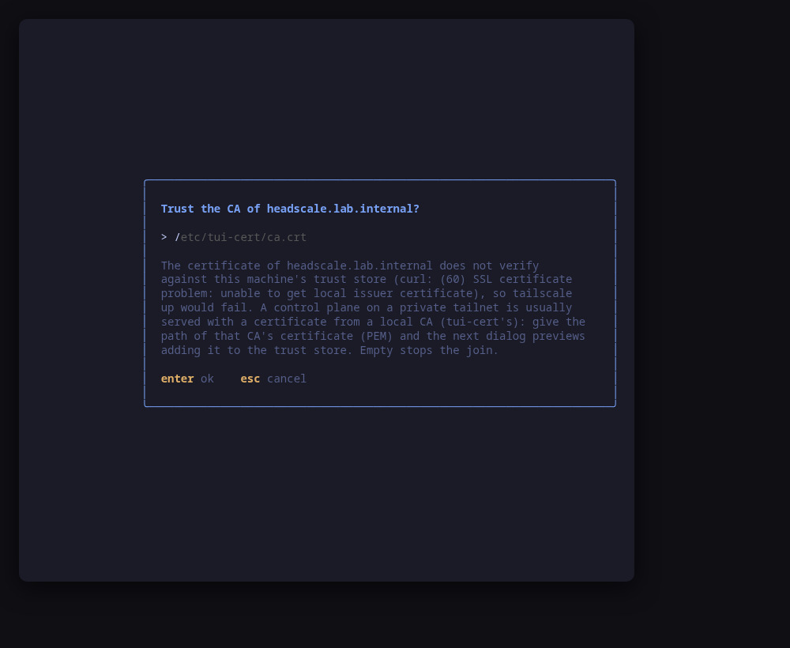
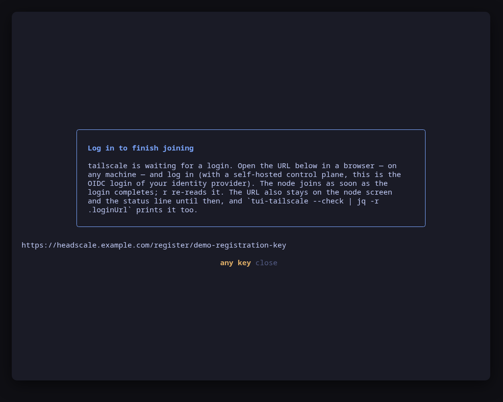
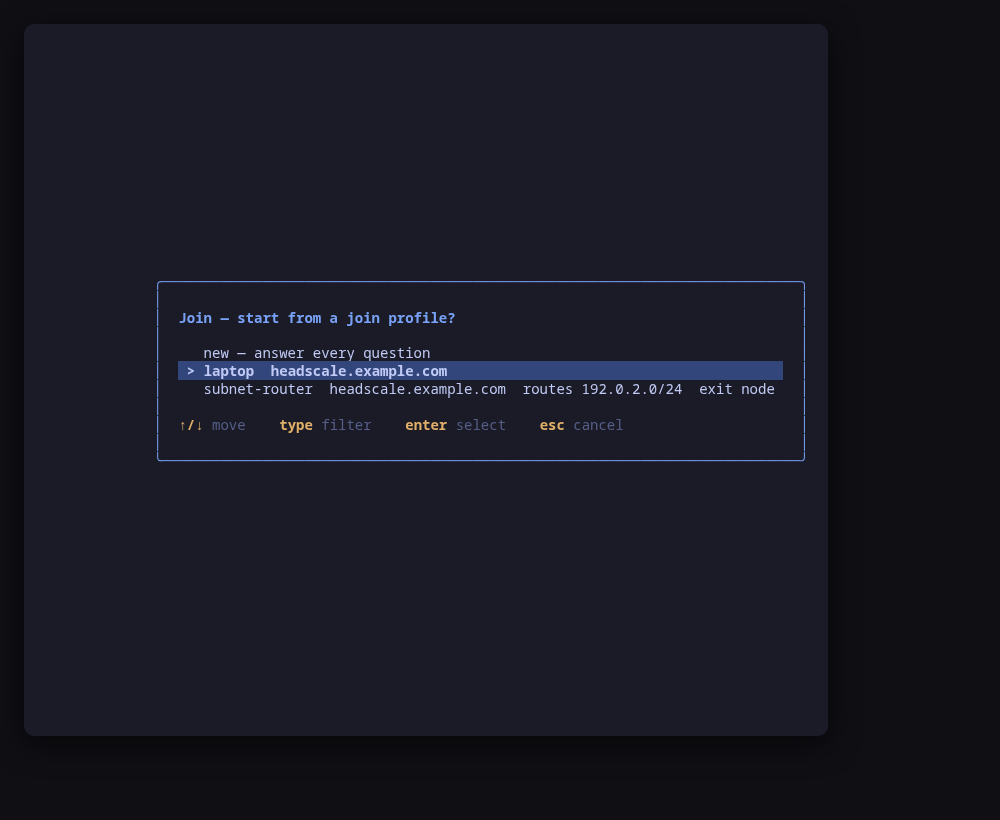
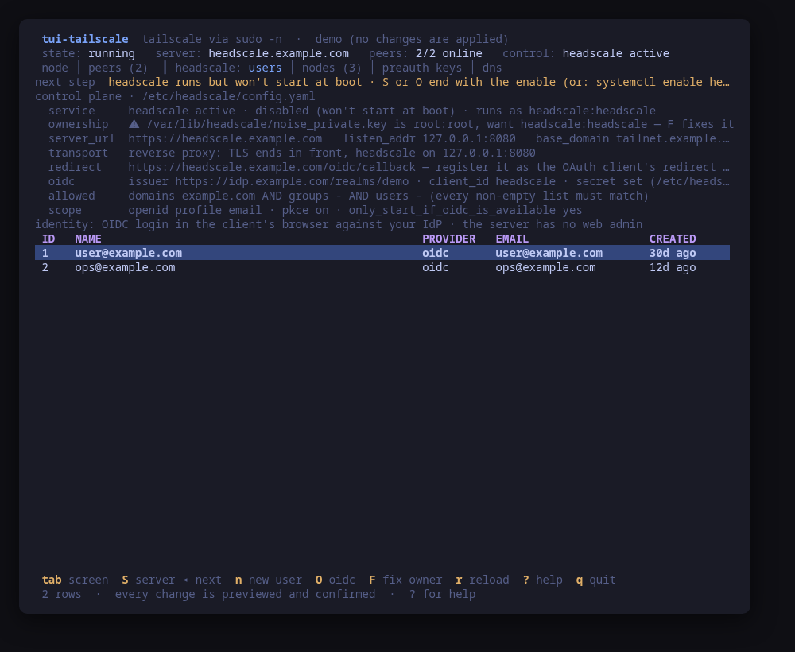
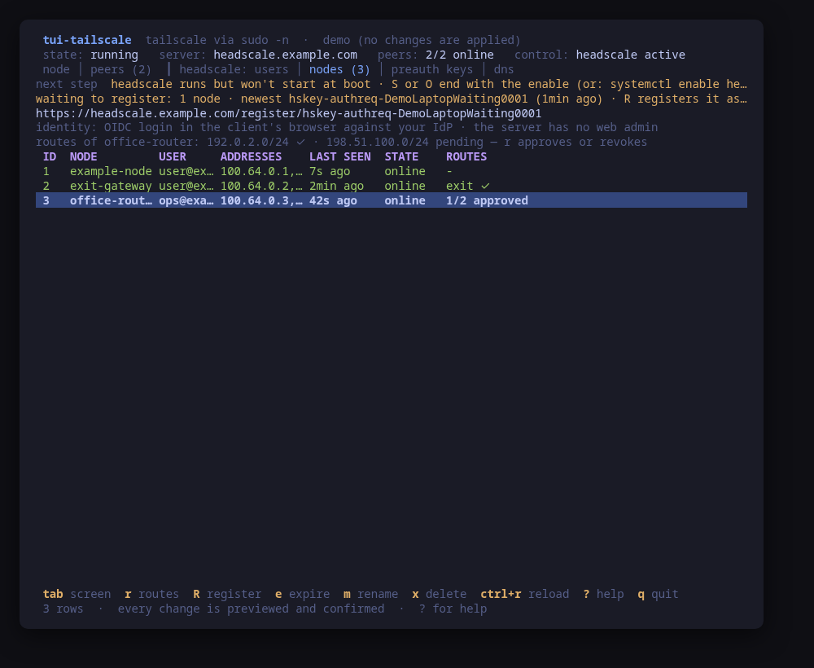
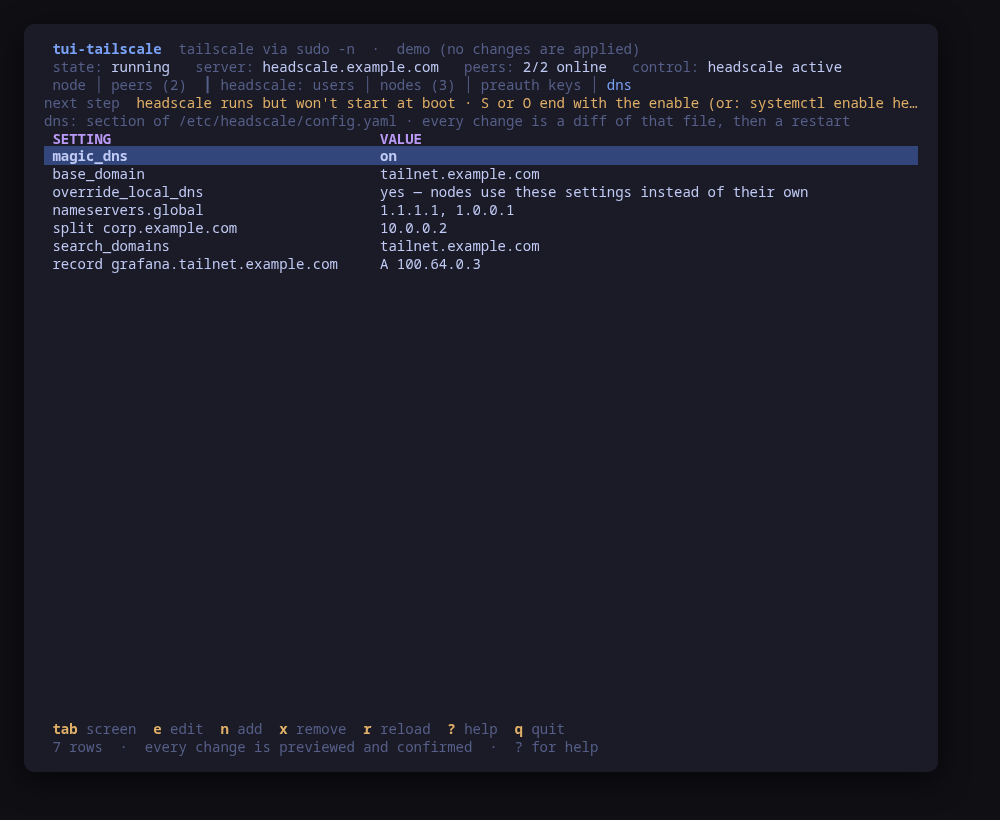
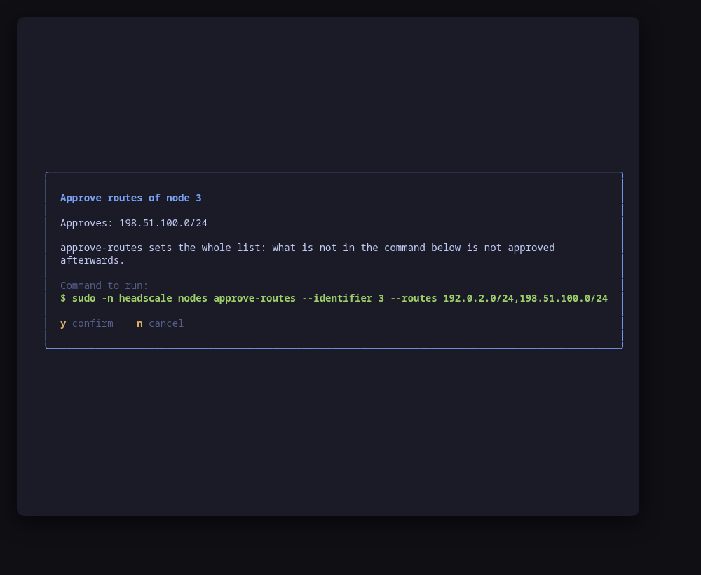

[](https://scorecard.dev/viewer/?uri=github.com/tui-tools/tui-tailscale)

> **Beta.** The family is days old and still changing. Package names, flags
> and keys may move without notice until 1.0. Pin versions, and report what
> breaks.

# tui-tailscale

Self-hosted Tailscale from the terminal, both ends of it: the [Headscale](https://headscale.net) control plane on this host, and this machine as a node of a tailnet.

As a node, tui-tailscale drives the `tailscale` client, whichever control plane it answers to — a self-hosted Headscale or Tailscale's own. It shows the node — its state, the login server, its name and tailnet addresses, and the settings that decide what it routes — and the peers it sees, and it joins a tailnet, changes those settings, disconnects and logs out.

As a control plane, it drives the `headscale` on this host: its users, nodes and pre-auth keys, the server and identity-provider settings in `/etc/headscale/config.yaml`, the unit that runs it, the ownership of its files, and the routes its nodes advertise. One line on those screens says what is missing next, in order, and the key that does it. See [Control plane (headscale)](#control-plane-headscale).

It manages as well as reads. Every change is shown as the exact command line first and applied only after you confirm it. A process is started from exactly two places, one per backend — `internal/tailscale` and `internal/headscale` — so the command the dialog showed is the command that runs.


## Try it with nothing installed

```sh
tui-tailscale --demo
```

`--demo` runs every screen against one sample tailnet, both ends of it: a fake node joined to `https://headscale.example.com`, with two peers — `exit-gateway`, which offers itself as an exit node, and `office-router`, which serves a subnet — and the fake control plane that serves them, where the node is registered under `user@example.com` and `office-router` advertises a second subnet nobody approved yet, so `r` has something to approve; a laptop waits to register, so `R` has one to register; the DNS section carries a split domain and an extra record; two join profiles pre-fill `j`, and a login server under `.internal` (`https://headscale.lab.internal`) walks the private-CA step. Its unit runs but is disabled, the way a fresh install is usually left, so the readiness line and the end of `S` and `O` show the enable. Every key works, every command is built and previewed for real, and each confirmed one is applied to the fake — nothing on the host is read or changed.

## Screens

`tab` (or `1` to `6`) switches between them. `j` and `h` are actions here, so the selection moves with the arrow keys. The header names both backends with their versions — `tailscale 1.102.4` and `headscale 0.29.3`, or `headscale: not installed` — and the keys belong to the screen they are pressed on: the node's on the node and peers screens, the control plane's on the other four.

- **node** — the backend state (running, stopped, logged out, waiting for approval), the login server and whether it is self-hosted, the owner, the hostname and MagicDNS name, the tailnet addresses, and the settings: accept routes, advertised routes, the exit node in use, whether this node offers itself as one, accept DNS, the client version and its health warnings. A login waiting for a browser shows its URL here until it completes. When tailscale is not installed, or tailscaled is not running, or refuses this user, the screen says so and what to do.
- **peers** — the rest of the tailnet: name, owner, tailnet address, online (or when last seen), OS, whether the peer offers an exit node or is the one in use, and the subnets it serves (its primary routes and any allowed prefix beyond its own addresses).

- **users**, **nodes**, **preauth keys**, **dns** — the control plane on this host, behind a `headscale:` mark in the tab bar so its nodes cannot be read as this node's peers. See [Control plane (headscale)](#control-plane-headscale).


## First tailnet

The guided path from an empty host to a working tailnet, with this host as both the control plane and the first node, serving a subnet to the others. Every step below is one key, previewed and confirmed; the readiness line on top of the control-plane screens names the next one if you lose track. The names are examples: `vpn.example.com` for the control plane, `10.0.0.0/16` for the network behind this host, `user@example.com` for the person logging in.

1. **Install headscale.** Switch to the users screen (`3`) and press `i`. The package comes from pkgs.tui.tools and leaves the unit stopped, waiting for a configuration.
2. **Set the transport.** `S` on the users screen asks for the transport first, then `server_url` (`https://vpn.example.com`), `listen_addr` and `dns.base_domain` (a private name such as `tailnet.internal`, never a suffix of `vpn.example.com`). The diff is written, and the last confirm enables and starts the unit.
3. **Pick how machines get in.** Either `O` for an identity provider, or a pre-auth key: `n` on the users screen creates a user, then `n` on the preauth keys screen (`5`) creates a key for it, shown once.
   With Google, the preset needs `server_url` on https with a DNS name, because Google refuses a redirect URI that is plain http or an IP address; register `https://vpn.example.com/oidc/callback` as the OAuth client's redirect URI. headscale applies the allow lists as AND: a login has to match every list that is not empty, so with `allowed_domains: [example.com]` an address from another domain is refused even when `allowed_users` names it. `allowed_users: [user@example.com]` alone lets exactly that person in.
4. **Install tailscale.** Back on the node screen (`1`), `i` installs the client from Tailscale's own package repository and starts `tailscaled`.
5. **Join.** `j` offers this host's control plane as the login server. Paste the pre-auth key, or leave it empty and open the login URL the tool shows in any browser to log in through the IdP. Advertise `10.0.0.0/16` to make this host a subnet router; the same preview turns IP forwarding on.
   If the join seems to hang, look at the nodes screen (`4`): a node that started its registration and has not logged in yet is listed there as waiting, with the URL that finishes it, and `R` registers it without a browser.
6. **Approve the routes.** On the nodes screen (`4`), select this host and press `r`: the list is prefilled with what it advertises, so approving it is one keystroke.
7. **Join the clients.** On every other machine, join with routes accepted, so it reaches `10.0.0.0/16` through this host:

   ```sh
   tailscale up --login-server=https://vpn.example.com --accept-routes
   ```

   A machine that already runs tui-tailscale does the same with `j` and a yes to accepting routes, or `a` once joined.

This is the path validated end to end on a real Ubuntu 24.04 host, with Google as the identity provider and the host serving a subnet to its clients.

## Private tailnet

A tailnet with no public DNS name and no Let's Encrypt: headscale on https with a certificate from a local certificate authority (tui-cert issues one), clients that trust that CA, and the host's ports opened by tui-firewall (a cloud image's INPUT chain usually ends in REJECT). The names are examples: `headscale.lab.internal` for the control plane, `/etc/tui-cert/ca.crt` for the CA's certificate.

1. **Serve the certificate.** `S` on the users screen, transport *own certificate*, and the paths of the certificate and key tui-cert issued for `headscale.lab.internal` (checked from this machine: the account headscale runs as has to be able to read both).
2. **Open the ports.** The readiness line reads the host firewall and says when `443/tcp` (the control plane) is closed, and whether `41641/udp` (the node's direct connections) is; `f` hands the terminal to tui-firewall to open them, and they are read again when it exits. See [the ports step](#the-next-step).
3. **Join, trusting the CA.** `j` checks the login server's certificate against this machine's trust store before it runs `tailscale up`. When it does not verify, the join says so and asks for the CA's certificate: typed as a path, previewed as the distribution's own way of adding a trust anchor, then the join goes on:

   | Distribution | Trust step |
   | --- | --- |
   | Debian, Ubuntu | `install -m 644 <ca> /usr/local/share/ca-certificates/tui-tailscale-<host>.crt` and `update-ca-certificates` |
   | Fedora, RHEL | `install -m 644 <ca> /etc/pki/ca-trust/source/anchors/tui-tailscale-<host>.crt` and `update-ca-trust` |
   | Arch, Omarchy | `trust anchor --store <ca>` |

   

   Each ends with `systemctl restart tailscaled`, because a running daemon keeps the roots it loaded at start. The dialog says what trusting a CA means: every program on the machine that uses the system trust store trusts what it signs. A certificate that is trusted but issued for another name is reported as such, since no CA fixes it.

## Manage, not view

### Join a tailnet (`j`)

Six questions — login server, an optional pre-auth key, hostname, accept routes, subnets to advertise, offer an exit node — and one dialog that previews the whole join:


The command is `tailscale up --login-server=<url> … --reset`. `--reset` returns every setting not on the line to its default, so tailscale never refuses the change with its "mention all non-default flags" error; the dialog says so. `--timeout=20s` stops the command from blocking the UI while it waits; the join itself goes on in tailscaled. A node already logged in to a different server gets `--force-reauth`, which tailscale requires to change servers.

**This control plane.** When headscale on this host is configured for clients, the login server step is prefilled with its `server_url`: joining this host to its own control plane is the usual first node. The help says so, and names the server the node is joined to now when it is another one.

The login server is validated the way the control plane's `S` validates headscale's `server_url` from the other side: an http(s) URL whose host is an address that parses or a DNS name, with no user info and a real port.

**With a pre-auth key**, the key is typed masked and never put on a command line. It travels on the standard input of `install`, which writes it mode 600 to `/run/tui-tailscale.authkey` (root-owned, on a tmpfs); tailscale reads it from there through `--authkey=file:…`; and `rm -f` removes the file after the join, whether the join worked or not. The key appears in no argv, no preview and no status line.

**Without a key**, tailscale prints a login URL. tui-tailscale takes it from the command's output and shows it in a dialog and alone on the status line: open it in a browser, on any machine, and log in. With a self-hosted Headscale that is your identity provider's OIDC login. The node joins as soon as the login completes, and the URL stays on the node screen until then. While a login is pending the tool re-reads the node every few seconds on its own (for about three minutes; `r` re-reads by hand after that), because headscale takes up to half a minute after the browser confirms to finish the registration. When the login went through, the URL on the status line is replaced by `joined <tailnet> as <user>` and the dialog closes; when the pending login disappears without one, the status line says it expired instead of keeping a dead link. Wherever it is shown, the URL sits on a line of its own, flush left, never wrapped and never inside a frame, so a terminal selection copies the URL and nothing else. On a terminal narrower than the URL the line is cut at the edge; `tui-tailscale --check | jq -r .loginUrl` prints it whole.



When the join advertises routes or an exit node, the same preview turns IP forwarding on, persistently: `install` writes `/etc/sysctl.d/99-tailscale.conf` and `sysctl -w` applies it now. tailscale warns about missing forwarding but does not set it.

### Join profiles

A machine that leaves and re-joins its tailnet while things are being set up (a logout to test a fresh join, a re-key, a move to a new control plane) is asked the same six questions every time. A **join profile** is this tool's preset for `j`: those answers under a name. When there are any, `j` opens with a picker (a saved profile, or new questions); picking one pre-fills every step, still editable and still previewed, so the join is confirm-and-go. The profile that matches the node's current settings is the one offered.

After a join with new answers (right away with a pre-auth key, or once a browser login completes), the tool offers to save them: type a name, or leave it empty to skip. The save is a previewed write of the config file, with the lines that change shown as a diff: `/etc/tui-tailscale/config.toml` for root, `~/.config/tui-tailscale/config.toml` for any other user (written as that user; its profiles override the machine-wide ones of the same name). A profile is a `[[profile]]` table with `name`, `login_server`, `hostname`, `accept_routes`, `advertise_routes` and `advertise_exit_node` (see [`examples/config.toml`](examples/config.toml)). It never holds a secret: the pre-auth key is asked for every time and is not part of a profile.



The node screen names the join profile that matches its settings, and the logout dialog says which one restores them. `--check` lists the profile names only (`joinProfiles`).

**Login profiles are something else.** tailscale keeps one login profile per identity it has logged in with (`tailscale switch --list`). The node screen shows the one in use and how many there are, and `p` switches between them (`tailscale switch <id>`, previewed) when there is more than one.

### One setting at a time

Each of these is one `tailscale set --<flag>=<value>`, which changes that setting and leaves every other one alone:

| Key | What | Command |
| --- | --- | --- |
| `a` | toggle accepting the routes other nodes advertise | `tailscale set --accept-routes=true\|false` |
| `A` | edit the subnets this node advertises (empty clears them) | `tailscale set --advertise-routes=<cidrs>` |
| `x` | pick the exit node to use, from the peers that offer one, or none | `tailscale set --exit-node=<ip>` |
| `E` | toggle offering this node as an exit node | `tailscale set --advertise-exit-node=true\|false` |
| `h` | set the hostname | `tailscale set --hostname=<name>` |

Routes are validated before they reach an argv: a prefix with host bits set (`192.168.1.1/24`) is refused with the prefix it probably meant, and a default route is pointed at `E` instead. Advertising routes or an exit node adds the same forwarding steps as the join. Advertised routes still have to be approved on the control plane (on Headscale, `headscale nodes approve-routes`, or `r` on the control plane's nodes screen).


### Down, up, logout (`d`, `u`, `L`)

`d` is `tailscale down`: the node goes offline and keeps its login. `u` is a plain `tailscale up`, which brings it back with the settings it had. `L` is `tailscale logout`. `d` and `L` open in the danger colour, because if you are connected to this machine over the tailnet they end that session.

### Install tailscale (`i`)

When `tailscale` is absent, the node screen says how to install it on this distribution (read from `/etc/os-release`), and `i` previews and runs exactly those commands — Tailscale's documented package-manager steps, never its `curl | sh` script:

- **Ubuntu and Debian**: Tailscale's signing key and apt source list for the release's codename, fetched from pkgs.tailscale.com into `/usr/share/keyrings` and `/etc/apt/sources.list.d`, then `apt-get update` and `apt-get install -y tailscale`.
- **Fedora** (and the RHEL rebuilds): Tailscale's `.repo` file fetched into `/etc/yum.repos.d` — the file `dnf config-manager --add-repo` would add, written in the way that works with both dnf4 and dnf5 — then `dnf install -y tailscale`.
- **Arch and Omarchy**: `pacman -Syu --needed --noconfirm tailscale`. Arch supports no partial upgrade, so refreshing the package database to install one package upgrades the machine with it; the dialog says so.

Each ends with `systemctl enable --now tailscaled`. Anything else is pointed at https://tailscale.com/download/linux.

## Control plane (headscale)

### Identity is OIDC, not a web admin

User login is deliberately not in this tool. Identity is OpenID Connect, done in the client's own browser against your IdP; Headscale mirrors the users and nodes the IdP authorises. The Headscale server exposes no web admin, which is the whole point of the design — there is no console to log into, and tui-tailscale does not pretend to be one.

What tui-tailscale does own is the *configuration* of that identity: `S` and `O` on the users screen write `/etc/headscale/config.yaml` for you, previewing the exact lines they change.

### The screens

- **users** — the Headscale users, and the provider they authenticate against, under a panel showing what `/etc/headscale/config.yaml` says: `server_url`, `listen_addr`, `dns.base_domain`, the transport and the OIDC redirect URI it implies, the OIDC issuer and client id, whether a client secret is set, the allow lists, and the state of the `headscale` unit: active or not, enabled at boot or not, the account it runs as, and whether that account owns its state files. `n` creates a user; `S` and `O` configure the control plane; `F` fixes the ownership of headscale's files.
- **nodes** — the machines registered with Headscale, who owns each, key expiry, and the routes each advertises with whether they are approved. `r` approves or revokes routes, `e` expires a node, `m` renames one, `x` deletes one (`ctrl+r` reloads here, since `r` is taken).
- **preauth keys** — the keys that let a machine register itself, shown by prefix only. `n` creates one, shown exactly once.
- **dns** — headscale's `dns:` section, one row per setting, split domain and extra record. See [DNS](#dns-the-dns-screen).



**When the headscale unit is not running**, the users, nodes and keys screens do not ask the CLI (it talks to the running server over a socket, so every list would fail) and say what to do instead: `headscale is not running · S configures and starts it` on a fresh install, `systemctl start headscale` when `server_url` is already set up, and `journalctl -u headscale` when the unit has failed. `S`, `O` and `F` keep working, since they only need the configuration file. When the CLI fails for another reason, the screen shows the `error` field of the JSON it printed rather than its first raw line.



### The next step

A control plane comes up in an order, and each step only makes sense once the one before it is done. The line on top of the three screens names the first one missing, with the key that does it:

| Step | Done when | Otherwise the line says |
| --- | --- | --- |
| install | the `headscale` binary is here | `i` installs it |
| server | `server_url` is set, valid and not loopback, and `dns.base_domain` is one headscale will start with | `S` sets the transport, `server_url` and `base_domain` |
| unit | the unit is running, and enabled at boot | how to start it, or that `S` and `O` end with the enable |
| ports | the host firewall lets new connections reach the `server_url` port (443/tcp for https) | `443/tcp is closed in the host firewall` — `f` opens tui-firewall |
| identity | OIDC is configured, or a pre-auth key can still register a machine | `O` sets up an identity provider, or `n` on the keys screen creates a key |
| first node | a node is registered | `j` on the node screen joins this host, or `tailscale up --login-server=…` on another machine; when a node is already waiting for its login, `R` on the nodes screen registers it |
| routes | no advertised route waits for approval | `routes pending approval (N)` — `r` on the nodes screen |

The ports step reads the host firewall, and never changes it: `tui-firewall --check` when the family's firewall tool is installed (it already understands ufw, firewalld and nftables), otherwise `nft -j list ruleset` or `iptables -S INPUT`, all escalated. A rule this reader cannot judge (a jump to another chain, a match on an interface or a source) never decides the answer, and a firewall it cannot read is reported as unknown rather than open or closed. A closed `41641/udp` is not a missing step, since peers then relay through DERP, but the ready line says so. `f`, on any control-plane screen, hands the terminal to tui-firewall the way the tui-tools launcher starts a family tool, with no argument; the screen comes back, and re-reads, when it exits. `--check` reports the answer as `readiness.ports`: the source, the two ports and what the firewall does to each (`open`, `closed` or `unknown`).

The hint bar at the bottom says the same: on the screen where the next step is done, its key comes first, marked `◂ next` (`S` on the users screen while the server is not set up, `j` on the node screen while there is no node, `r` on the nodes screen while routes wait).

`--check` carries the same answer as `headscale.readiness`: each step as a boolean (`serverConfigured`, `unitRunning`, `unitEnabled`, `oidcConfigured`, `preAuthKey`, `firstNode`, `routesApproved`, with `routesPending` and `pendingRegistrations` counted), `next` naming the first missing one, and `nextStep` the sentence.

### Nodes waiting to register (`R` on the nodes screen)

A client that runs `tailscale up --login-server=…` without a key starts a registration that headscale keeps in a cache for 15 minutes and nowhere else: `headscale nodes list` does not show it, and the client may print nothing at all (a stale identity from another control plane does that). headscale does log it, so the tool reads the unit's journal of the last 15 minutes (`journalctl -u headscale`, escalated) and lists every registration started there and not confirmed yet. The nodes screen says how many are waiting and prints the newest one's `/register/<id>` URL on a line of its own, for a browser; `R` finishes it from here instead, as a user you pick: `headscale auth register --auth-id <id> --user <user>` on headscale 0.29 and later, `headscale nodes register --key <id> --user <user>` before. `--check` counts them (`pendingRegistrations`) and prints neither the ids nor the URLs.

### Install headscale (`i` on a control-plane screen)

When `headscale` is absent, the control-plane screens say how to install it on this distribution, and `i` previews and runs exactly those commands. headscale comes from the tui-tools package repository at pkgs.tui.tools, which publishes the family's source-built mirror of the upstream release, signed and attested like every tool:

- **when the repository is not set up yet**, it is added first, the way the family's installer does it: the signing key downloaded, read back with `gpg --show-keys` and compared with the pinned fingerprint `767CFB337B01F32FFC073F3F389120B277E4FB44` before any repository file names it — the plan stops there if it differs — then the repository file and a refresh;
- then **the package**: `apt-get install -y headscale`, `dnf install -y headscale`, or on Arch and Omarchy `pacman -Syu --needed --noconfirm tui-tools/headscale` (the repository-qualified name picks the mirror over Arch's own package, and `-Syu` because Arch supports no partial upgrade: the machine is upgraded with it, and the dialog says so).

The package ships the binary, a hardened unit and an example `/etc/headscale/config.yaml`, and does not start the unit: `S` configures it and ends with the enable.

### Pre-auth keys (`n` on the preauth keys screen)

Pick the owning user by id and optionally add the words `reusable`, `ephemeral` and an expiration like `30m`, `24h` or `7d` (default `24h`). The previewed command is `headscale preauthkeys create --user <id> [--reusable] [--ephemeral] --expiration <dur>`. Headscale prints the key once; tui-tailscale shows it once in the status line with a "shown once — copy it now" note and never stores it. The list keeps showing prefixes only, like headscale's own CLI.

### Server settings (`S` on the users screen)

`S` is how clients reach the control plane. It starts with the **transport**, because the transport decides what every later answer means, and writes only the lines that transport needs into `/etc/headscale/config.yaml`:

| Transport | `server_url` | `listen_addr` | What else is written | What is cleared |
| --- | --- | --- | --- | --- |
| **plain http** | `http://`, an IP or a name | proposed as `0.0.0.0:<the URL's port>` | nothing | `tls_letsencrypt_hostname`, `tls_cert_path`, `tls_key_path` |
| **Let's Encrypt** | `https://` and a public DNS name; an IP is refused | `0.0.0.0:443` | `tls_letsencrypt_hostname` (the URL's host), `tls_letsencrypt_challenge_type` (`TLS-ALPN-01` when port 80 is closed, `HTTP-01` otherwise), `acme_email` (optional) | `tls_cert_path`, `tls_key_path` |
| **own certificate** | `https://` and the name on the certificate | `0.0.0.0:443` | `tls_cert_path`, `tls_key_path` | `tls_letsencrypt_hostname` |
| **reverse proxy** | `https://` and the name the proxy serves | loopback, refused otherwise | nothing: TLS ends at the proxy | `tls_letsencrypt_hostname`, `tls_cert_path`, `tls_key_path` |

"Cleared" means emptied where the file already has the key, and left alone where it does not: switching from Let's Encrypt to plain http empties `tls_letsencrypt_hostname`, so headscale stops asking for a certificate nobody wants, and a file that never had the key gains no empty line.

Every transport ends with **`dns.base_domain`**, the MagicDNS domain nodes are named under. It is checked the way headscale checks it at startup: a valid DNS name, required while `dns.magic_dns` is on, and not a suffix of the `server_url` host (MagicDNS owns every name under it, so clients could not reach the control plane, and headscale refuses to start).

A refused answer reopens its own step with the reason on top and what you typed still in it.

**The host is checked, not only the characters.** headscale does not validate the host of `server_url`, so a public IP typed with one digit too many (`http://203.0.113.1000:443`) used to be written and served, and every client then failed on a DNS lookup for a name that looks like an address. A host has to be an IP address that parses, or a DNS name whose last label is not all digits (no top-level domain is numeric). The same check applies to `listen_addr`'s address part and to the OIDC issuer, and a malformed value already in the file is flagged in the panel and shown with its problem when `S` proposes it.

**Plain http is a real option, not a mistake.** The Tailscale control protocol runs over Noise, so everything between clients and headscale is encrypted and authenticated whatever the URL scheme. The one thing that needs https is a browser: an OIDC login redirects to `<server_url>/oidc/callback`, and Google and most other IdPs refuse a redirect URI that is plain http or names a raw IP. So the panel explains plain http instead of warning about it, and only when OIDC is configured do the form and the confirm dialog say, before and after the answer, that browser logins will fail. The panel also shows that redirect URI, next to whether an IdP will accept it, because it is the value an OAuth client has to be registered with.

The painless case, a server reached by IP: pick **plain http**, type `http://203.0.113.10:443`, accept the proposed `0.0.0.0:443`, and give a private base domain such as `tailnet.internal`. The diff is three lines.

**An own certificate is checked before it is written.** The form `stat`s the certificate, the key and every directory above them from this machine, and refuses a pair the account headscale runs as cannot reach, naming the file or directory in the way. The pair [tui-cert](https://github.com/tui-tools/tui-cert) issues lives in its root-only `/etc/ssl/tui-cert`, which a `headscale` user cannot enter: its install step copies the pair wherever the service can read it. A path under `/home` or `/tmp` gets a warning, because the packaged unit hides those trees from the service. [tui-firewall](https://github.com/tui-tools/tui-firewall) opens the port, or port 80 for `HTTP-01`.

The confirm dialog shows a **diff of the changed lines and nothing else** (a value already in the file, however it is quoted, is not a change), then the write, then the step that makes headscale read it as a separate, optional confirm (see [The last step: restart, or enable](#the-last-step-restart-or-enable)).

### The last step: restart, or enable

`S` and `O` both end by making headscale read the new configuration, and what that takes depends on the unit, which the panel shows next to its active state (`headscale active · enabled`):

| The unit is | The last step previews |
| --- | --- |
| enabled (or static, indirect: anything that already starts at boot) | `systemctl restart headscale` |
| disabled and not running, which is how a fresh package install leaves it | `systemctl enable --now headscale` |
| disabled but running, started by hand | `systemctl enable headscale`, then `systemctl restart headscale` as its own confirm |

A disabled unit is the trap: a restart brings the control plane up now, and it is gone after the next reboot. `enable --now` would not help the third row either, because it leaves a running unit alone and the new configuration would never be read. Esc at any of these steps leaves the file written and the unit as it was.

### Identity provider (OIDC)

`O` on the users screen configures the whole `oidc:` section: issuer URL, client id, client secret, allowed domains, allowed groups, allowed users, scope (`openid profile email` by default), `only_start_if_oidc_is_available` and `pkce.enabled`.

**It starts with the provider.** The first step is a picker:

| Provider | What the preset does |
| --- | --- |
| **Google** | Fills the issuer (`https://accounts.google.com`) and the default scope, and **skips the groups step, emptying `allowed_groups`**: Google's ID token carries no groups claim, so any group there would make headscale refuse every login, the listed users included. `allowed_domains` (your Workspace domain) or `allowed_users` is the gate. It refuses to start when `server_url` is plain http or an IP address, because Google refuses such a redirect URI. |
| **generic OIDC** | Asks for the issuer (Keycloak, Authentik and the rest fit here). An issuer typed here that belongs to a preset, such as Google's, gets that preset's rules. |

**The redirect URI is in the dialog.** The client id step says `Register <server_url>/oidc/callback as the OAuth client's redirect URI`, which is the one value the OAuth client has to be created with, and warns when an IdP would refuse it.

**The allow lists are combined with AND.** headscale lets a login in only when it matches every list that is not empty: with `allowed_domains: [example.com]`, an address from another domain is refused even when `allowed_users` names it (`unauthorised domain` on `/oidc/callback`). The dialog says so on each list, warns when an `allowed_users` entry has a domain `allowed_domains` would refuse, and warns when all three are empty (anyone the IdP authenticates gets in). The panel flags both mistakes in a configuration it did not write: a user outside the domains, and `allowed_groups` set for an IdP that sends no groups claim.

**What is written where.** Two files, and only two:

| File | What lands in it | Mode |
| --- | --- | --- |
| `/etc/headscale/config.yaml` | every OIDC setting **except** the secret, plus `client_secret_path` pointing at the file below | unchanged (the write truncates in place and keeps the existing owner and mode; a `.bak` copy is taken first) |
| `/etc/headscale/oidc_client_secret` | the client secret, and nothing else | `600`, owned by the account the `headscale` unit runs as, created atomically by `install -o … -g … -m 600` |

**The secret is never shown.** It is typed with the echo masked, travels to the exec site on the command's **standard input** — never on an argv, which is visible in `ps` to every user on the machine — and is dropped from the tool's memory the moment the write command exists, cancelled flows included. It is not in the confirm dialog, not in the status line, not in the diff, and not in `config.yaml`: headscale reads it from the file through `client_secret_path`. The tool will not read it back either; the most it will ever say is `secret set`. When a secret is already configured, leaving the field empty keeps it, and typing a new one replaces it.

A secret found sitting *inline* in `config.yaml` — someone else's setup, or an older one — is flagged in the panel and emptied by the next `O`, because headscale refuses to start with both a secret and a secret path, and because a credential has no business being in a configuration file. The diff redacts that line rather than printing it.

**The diff is minimal, by construction.** `config.yaml` is not re-serialised: it is parsed only to *locate* each key, then spliced line by line, so comments, blank lines, key order and every section the change does not touch survive byte for byte. The lines the dialog shows are provably the only lines that differ.

**The issuer is checked before saving.** tui-tailscale fetches `<issuer>/.well-known/openid-configuration` with `curl` **from the server itself** — the machine that will have to reach the IdP — and reports what it found. A failure is a warning, not a refusal: an IdP that is down this minute is not a reason to be unable to write down its address.

**Then a restart.** A configuration change does nothing until the unit that reads it restarts, so the flow ends with `systemctl restart headscale` as its own confirm, or with the enable a disabled unit needs (see [the last step](#the-last-step-restart-or-enable)). Esc there leaves the file written and the running server on the old settings.

**The secret file is owned by the service, not by root.** tui-tailscale reads `systemctl show headscale -p User -p Group` and hands the file to that account in the same previewed `install`, so there is no second step and no window in which the ownership is wrong. It matters because units disagree: headscale's own `.deb` (0.29.3, checked on a real Ubuntu 24.04 host) and the Arch package run it as a dedicated `headscale` user, while a hand-written or older unit may run it as root — and a root-only secret file would leave a `headscale`-user service unable to read its own credential and unable to come back from the restart at the end of the flow. A unit that names no user gets `root:root`, which is what systemd would have used anyway. The mode stays `600` in every case: the owner is what changes, so the file is readable by exactly one account either way. The panel shows which account that is, next to the unit's state.

### State ownership (`F` on the users screen)

A common way to break a fresh control plane without noticing: run `sudo headscale configtest` (or any `headscale` subcommand) as root before the first start. That creates the noise private key and the SQLite database owned by `root`, while the packaged unit runs as `User=headscale`, and the service then fails at the restart that ends `S` or `O` with nothing pointing at the cause. systemd's `StateDirectory=` does not help: it fixes the owner of `/var/lib/headscale` itself, not of the files already inside it.

So the panel checks. It reads the unit's `User`/`Group` (the same read the secret file uses) and `stat`s:

| Path | Should belong to |
| --- | --- |
| `/var/lib/headscale`, and the directories under it that hold the files below | the account the unit runs as |
| `noise.private_key_path` (and a pre-0.23 top-level `private_key_path`) | the account the unit runs as |
| `database.sqlite.path`, with its `-wal` and `-shm` files (not checked for postgres) | the account the unit runs as |
| `/etc/headscale/oidc_client_secret`, which `O` writes | the account the unit runs as |
| `/etc/headscale/config.yaml.bak`, which every write takes | whoever owns `config.yaml`: it holds the same content, so no more and no less readable |

A path that does not exist yet is not a problem, and a unit that runs as root is never short of access, so only the backup is compared there. A mismatch shows next to the service state (`ownership ⚠ /var/lib/headscale/noise_private.key is root:root, want headscale:headscale — F fixes it`), and `F` previews the fix, one confirm per command:

- every mismatch inside `/var/lib/headscale` is covered by **one** `chown -R <user>:<group> /var/lib/headscale`, because a root-run headscale leaves more behind than the files the check names, and the whole directory belongs to the service anyway;
- a state file `config.yaml` puts anywhere else gets its own `chown <user>:<group> <file>`, never a recursive one: a database at `/srv/db.sqlite` must not turn into a `chown -R` of `/srv`;
- the secret file and the backup get a plain `chown` each.

The chain ends with the same restart (or enable) step as `S` and `O`, since a service that failed on these files needs one. `--check` reports the result as `ownershipChecked`, `ownershipOk` and `ownershipIssues` (path, role, current and wanted owner); an ownership that could not be read is reported as unchecked, never as fine.

### Routes: subnet routers and exit nodes (`r` on the nodes screen)

A node that runs `tailscale up --advertise-routes=10.0.0.0/16` (a subnet router) or `--advertise-exit-node` offers routes to the tailnet, and they stay pending until an admin approves them. The **ROUTES** column shows each advertised route with its state (`10.0.0.0/16 ✓`, `10.1.0.0/24 pending`), and the two exit routes (`0.0.0.0/0` and `::/0`) as one `exit node`.

`r` opens the selected node's routes, prefilled with everything it advertises, so approving what it offers is one keystroke. The list **replaces** the node's approvals, because that is what the command does: take an entry out to revoke it, leave the line empty to revoke them all; `exit` stands for both exit routes. The confirm says what is approved and what is revoked, and previews:

```sh
headscale nodes approve-routes --identifier <id> --routes 10.0.0.0/16,0.0.0.0/0,::/0
```

A revocation is a danger dialog, and revoking everything is written `--routes=` so the empty value is visible. (`headscale routes` no longer exists since 0.26; the field names were checked against headscale 0.29.3's own output: `available_routes`, `approved_routes`, `subnet_routes`.) `--check` reports each node's routes as counts, `nodeRoutes` with `advertised`, `approved`, `pending` and `exitNode`, never the networks themselves.

### DNS (the dns screen)

What nodes resolve, and how, lives in headscale's `dns:` section, and the dns screen edits all of it without opening `config.yaml`: MagicDNS and `base_domain`, `override_local_dns`, the global nameservers, split nameservers per domain (a private network's own resolver for its internal domain only, `169.254.169.254` for `oraclevcn.com` on an OCI VCN, say), the search domains, and the extra records headscale answers itself. `e` edits the selected row, `n` adds a split domain or a record, `x` removes the selected one.

Each change goes through the same splice writer as `S` and `O`: the confirm shows the lines of `config.yaml` that change and nothing else, the rest of the file (headscale's commented-out examples below `split: {}` included) is kept byte for byte, and the restart follows as its own confirm. Lists and maps are written in YAML flow style on the key's own line, so adding a split domain is one line of diff:

```yaml
    split: {"corp.example.com": ["10.0.0.2"], "oraclevcn.com": ["169.254.169.254"]}
```

Every edit is proven before it is shown: the edited file is read back, and what headscale would read has to be exactly what the form asked for; a `dns:` section written in a shape the splice cannot edit safely (in flow style, say) is refused rather than rewritten. The checks are headscale's own: `base_domain` is required while MagicDNS is on and must not contain the `server_url` host, a nameserver is an IP address or an `https://` DNS-over-HTTPS URL, a split domain needs at least one nameserver, and a record is `name type address` with A or AAAA only (headscale's own configuration notes that only those reach a Tailscale client, so a CNAME would be written and never answered). A record outside `base_domain` is allowed, with a note. While `extra_records_path` is set, the records come from that file and are not edited here.



`--check` reports the section as `dns` in `controlPlane`: the two switches and how many global nameservers, split domains, search domains and records there are, never the names and addresses themselves.

### Node rename and delete (`m` / `x`)

`m` renames the selected node (DNS-label names) via `headscale nodes rename --identifier <id> <name>`; `x` deletes it via `headscale nodes delete --identifier <id> --force` — `--force` because tui-tailscale's own confirm dialog is the prompt, and it is painted as a danger dialog.

All of the above works under `--demo` too, against the fake backend, with nothing installed and nothing changed.



## Privileges

Reading the node — `tailscale status --json` and `tailscale debug prefs` — runs as you: tailscaled lets a local user read its status. Only when the socket refuses you is the same read retried through the escalation prefix (`sudo -n` by default, `--sudo ""` to disable it). Every change escalates, previewed first. A user set with `tailscale set --operator=$USER` can run the tool with `--sudo ""`.

Reading the control plane escalates: the headscale CLI talks to a socket only root or the service account can open, and `/etc/headscale/config.yaml` and headscale's state directory are root-only. `systemctl`'s reads of the unit do not escalate, and neither does the one read that leaves the machine: the IdP's public discovery document, fetched with `curl` as you.

## `--report`, for bug reports

`--report` prints the block the bug form asks for: the tool and kit versions, the client's version, whether tailscaled answers and the state it reports, headscale's version and what systemd says about its unit, the distribution, the kernel and the terminal. It reads nothing privileged, and it carries no login server, address, node name or tailnet name, and nothing of headscale's configuration, users or nodes.

## `--check`, one read as JSON

```sh
tui-tailscale --check
```

reads the node and the control plane once and prints JSON for scripts. For the node, under `tailscale`: installed or not, whether tailscaled answers and why not, the backend state, whether a login is pending, the login server answered as `set` / `https` / `tailscaleControl` rather than printed, whether the node has an IPv4 and an IPv6 tailnet address, the settings as booleans and counts, the peers counted (total, online, offering an exit node, serving routes), and the `compat` block. When tailscale is absent it adds an `install` block with the distribution and the commands `i` would run. It prints no address, name or URL of the node or its tailnet. The one exception is a pending login: while one waits for a browser, the top-level `loginUrl` carries its URL, a one-time registration link, so `tui-tailscale --check | jq -r .loginUrl` is a copyable fallback.

For the control plane, under `headscale`: whether headscale is present, user, node (online, expired) and pre-auth key counts, each node's routes counted (`nodeRoutes`: `advertised`, `approved`, `pending`, `exitNode`), the [readiness](#the-next-step), and a `controlPlane` block read from `/etc/headscale/config.yaml`: `serviceState` and `serviceEnabled` (what `systemctl is-active` and `is-enabled` answer for the unit), `serviceAccount`, the ownership check (`ownershipChecked`, `ownershipOk`, `ownershipIssues`), `oidcClientId`, the scope, whether a client secret is set, and the answers below. With the unit stopped, `headscale.error` is the same sentence the screens show and `headscale.notRunning` is true. `oidcConfigured` comes from that configuration; the older guess — inferred from users carrying a provider and nodes registered through OIDC — stays as `oidcInferred`, the answer used on a host whose `config.yaml` cannot be read. When headscale is absent the block adds an `install` block with the commands `i` would run.

It keeps the same promise — no URL and no address of the host. What an "OIDC does not work" report needs is the two ways the setup fails, not the URL that names your server, so:

| Instead of | `--check` prints |
| --- | --- |
| `server_url` | `serverUrlSet`, `serverUrlHttps`, `serverUrlLoopback` and `serverUrlIsIp` — the questions worth asking, as booleans — and `transport` (`plain-http`, `letsencrypt`, `own-cert` or `reverse-proxy`) |
| `listen_addr` | `listenPort` and `listenLoopback`, because a bind address can name an internal interface |
| the OIDC issuer URL | `oidcIssuer`, reduced to the issuer's **host name** — which IdP, without the realm and path that describe your internal layout |

When OIDC is configured, `oidcReadiness` answers whether a browser login can work: `redirectHttps` (https on a DNS name, not loopback), `allowListsNonEmpty`, `groupsWithNoGroupsIdp` (the Google case above) and `usersOutsideDomains` (a count, not the addresses). `issuerReachable` is in it only with `--check --probe-issuer`, which fetches the issuer's discovery document from this machine the way `O` does; a plain `--check` never goes on the network.

`baseDomain` is printed as it is, like the issuer's host: it is the tailnet's own naming, and `baseDomainConflict` answers whether headscale would refuse to start over it. The allow lists are counted rather than printed, because they name people, and the client secret has no field at all — only `oidcClientSecretSet`. `test/smoke.sh` asserts that no `://` survives anywhere in the output but a pending login's `loginUrl`.

The `compat` block lists both backends: the tailscale client and headscale, each with its version and whether it is tested.

## Usage

```sh
tui-tailscale                 # this machine's node, and headscale on it
tui-tailscale --demo          # sample tailnet, nothing is touched
tui-tailscale --check         # one read, as JSON
tui-tailscale --check --probe-issuer   # and whether the OIDC issuer answers from here
tui-tailscale --report        # what a bug report needs, then exit
tui-tailscale --sudo ""       # no escalation (root, or the operator user)
tui-tailscale --theme ~/mytheme/colors.toml
tui-tailscale --version
```

Configuration is read from `/etc/tui-tailscale/config.toml`, then `~/.config/tui-tailscale/config.toml`, then `TUI_TAILSCALE_*` in the environment; see [`examples/config.toml`](examples/config.toml).

## Install

<!-- install:start -->
<!-- Generated by tui-kit/tools/render-install.py from tool.json. -->
<!-- Edit the manifest, then run `make readme`. -->

### Arch Linux

Needs the tui-tools repository, which is a [one-time
setup](https://tui.tools/install/).

The one-liner detects the distribution and adds the repository and its signing
key:

```sh
curl -fsSL https://pkgs.tui.tools/install.sh | sh
```

Piping a script into a shell is not this family's style, so here is the same
setup by hand — read it, or read the script first with `curl -fsSL
https://pkgs.tui.tools/install.sh -o install.sh`:

```sh
curl -fsSL -o /tmp/tui-tools.asc https://pkgs.tui.tools/pubkey.asc
sudo pacman-key --add /tmp/tui-tools.asc
sudo pacman-key --lsign-key \
  "$(gpg --show-keys --with-colons /tmp/tui-tools.asc | awk -F: '/^fpr:/{print $10; exit}')"
printf '[tui-tools]\nServer = https://pkgs.tui.tools/arch/$arch\n' \
  | sudo tee -a /etc/pacman.conf
sudo pacman -Sy
```

Then, and for every other tool in the family:

```sh
sudo pacman -S tui-tailscale
```

Upgrades then arrive with the rest of your system updates.

### Debian and Ubuntu

Needs the tui-tools repository, which is a [one-time
setup](https://tui.tools/install/).

The one-liner detects the distribution and adds the repository and its signing
key:

```sh
curl -fsSL https://pkgs.tui.tools/install.sh | sh
```

Piping a script into a shell is not this family's style, so here is the same
setup by hand — read it, or read the script first with `curl -fsSL
https://pkgs.tui.tools/install.sh -o install.sh`:

```sh
sudo install -d -m 0755 /etc/apt/keyrings
curl -fsSL https://pkgs.tui.tools/pubkey.asc \
  | sudo gpg --dearmor -o /etc/apt/keyrings/tui-tools.gpg
echo "deb [signed-by=/etc/apt/keyrings/tui-tools.gpg] https://pkgs.tui.tools/deb stable main" \
  | sudo tee /etc/apt/sources.list.d/tui-tools.list
sudo apt update
```

Then, and for every other tool in the family:

```sh
sudo apt install tui-tailscale
```

Upgrades then arrive with the rest of your system updates.

### Fedora and RHEL

Needs the tui-tools repository, which is a [one-time
setup](https://tui.tools/install/).

The one-liner detects the distribution and adds the repository and its signing
key:

```sh
curl -fsSL https://pkgs.tui.tools/install.sh | sh
```

Piping a script into a shell is not this family's style, so here is the same
setup by hand — read it, or read the script first with `curl -fsSL
https://pkgs.tui.tools/install.sh -o install.sh`:

```sh
sudo rpm --import https://pkgs.tui.tools/pubkey.asc
sudo curl -fsSL -o /etc/yum.repos.d/tui-tools.repo https://pkgs.tui.tools/rpm/tui-tools.repo
sudo dnf makecache
```

Then, and for every other tool in the family:

```sh
sudo dnf install tui-tailscale
```

Upgrades then arrive with the rest of your system updates.

### Any distribution, static binary

```sh
curl -fsSL https://github.com/tui-tools/tui-tailscale/releases/download/v0.1.0/tui-tailscale_0.1.0_linux_amd64.tar.gz | tar -xz tui-tailscale
sudo install -m0755 tui-tailscale /usr/local/bin/tui-tailscale
```

One static binary. Verify it against checksums.txt from the same release.

### From source

```sh
git clone https://github.com/tui-tools/tui-tailscale
cd tui-tailscale && make build
sudo install -m0755 bin/tui-tailscale /usr/local/bin/tui-tailscale
```

Needs Go 1.27 or newer.

Not packaged for these yet; the static binary works everywhere in the meantime.

### Arch Linux (AUR) — coming soon

```sh
paru -S tui-tailscale-bin
```

The -bin package installs the released static binary.

### openSUSE — coming soon

Needs the tui-tools repository, which is a [one-time
setup](https://tui.tools/install/).

```sh
sudo zypper install tui-tailscale
```

The rpm repository is shared with dnf; zypper support is not tested yet.

### Verify a download

Every release of `tui-tailscale` ships a `checksums.txt`. Check an archive
against it before installing:

```sh
sha256sum -c checksums.txt --ignore-missing
```

Website: https://tui.tools/tools/tui-tailscale/
<!-- install:end -->

## Compatibility

<!-- compat:start -->
<!-- Generated by tui-kit/tools/render-compat.py from tool.json. -->
<!-- Edit the manifest, then run `make readme`. -->

`tui-tailscale` probes its backend once at startup and shows the version in the
header. A version nobody has tested is marked `(untested)` there rather than
hidden; one below the minimum is marked as such and the tool still runs.

### tailscale

| | |
| --- | --- |
| Binary | `tailscale` |
| Version read with | `tailscale version` |
| Minimum | 1.60.0 |
| Tested | `1.98.4`, `1.102.4` |

### headscale

| | |
| --- | --- |
| Binary | `headscale` |
| Version read with | `headscale version` |
| Minimum | 0.22.0 |
| Tested | `0.29.3` |

| Versions | What changes |
| --- | --- |
| `<0.23` | `preauthkeys list` requires a `--user`, so the pre-auth keys screen may be empty; users and nodes are unaffected |

The tested versions are generated from `compat/results.jsonl`, which the tool's
own smoke test appends to when it runs against a real machine in
[tui-lab](https://github.com/tui-tools/tui-lab).
<!-- compat:end -->

## Contributing

Contributions arrive as pull requests: [tui-kit's
CONTRIBUTING.md](https://github.com/tui-tools/tui-kit/blob/main/CONTRIBUTING.md)
is the family's process and the bar a change has to clear. A security problem
is reported the way [SECURITY.md](SECURITY.md) describes, privately, never in a
public issue.

## License

MIT — see [LICENSE](LICENSE). Part of the
[tui-tools](https://github.com/tui-tools) family.
