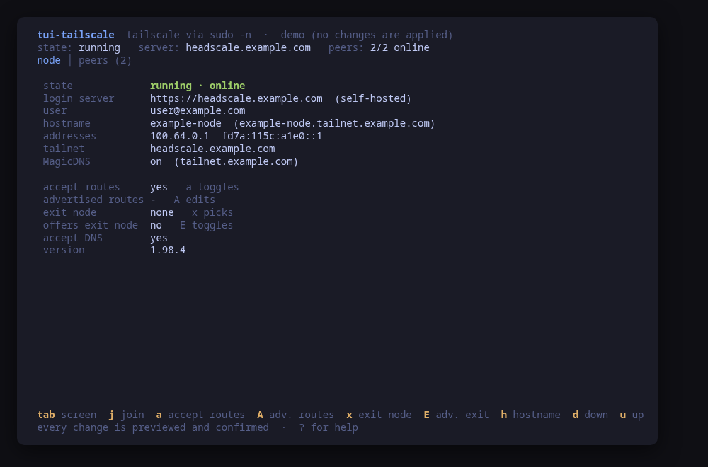
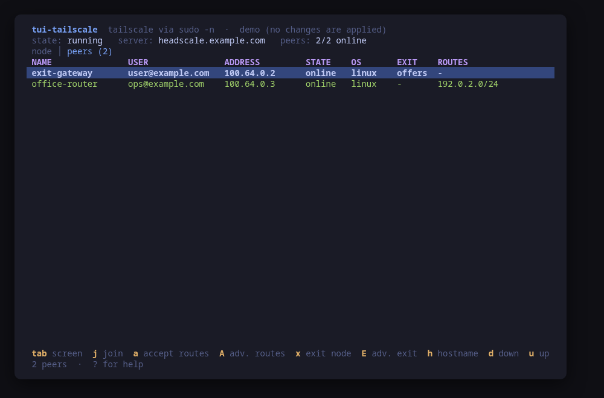
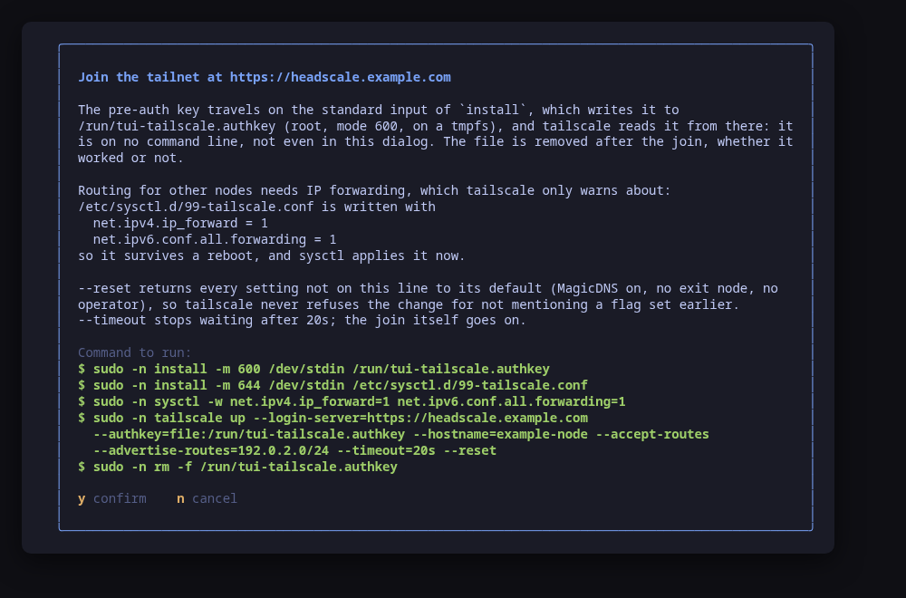
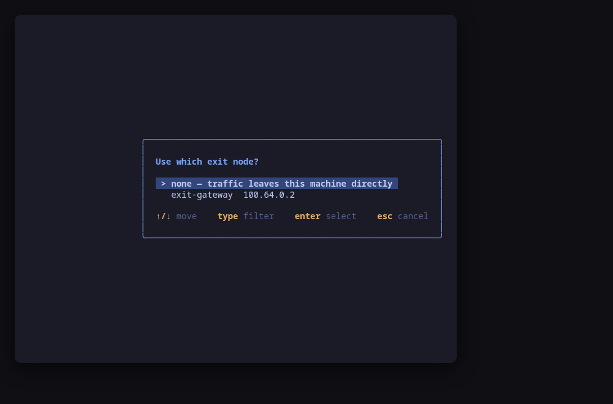

[](https://scorecard.dev/viewer/?uri=github.com/tui-tools/tui-tailscale)

> **Beta, and unreleased.** This tool is private until its first release is validated in the lab. Flags and keys may move without notice.

# tui-tailscale

Self-hosted Tailscale from the terminal, both ends of it: this machine as a node of a tailnet today, the [Headscale](https://headscale.net) control plane next.

tui-tailscale drives the `tailscale` client, whichever control plane it answers to — a self-hosted Headscale or Tailscale's own. It shows the node — its state, the login server, its name and tailnet addresses, and the settings that decide what it routes — and the peers it sees, and it joins a tailnet, changes those settings, disconnects and logs out.

It manages as well as reads. Every change is shown as the exact command line first and applied only after you confirm it. There is one place a process is ever started, `internal/tailscale`, so the command the dialog showed is the command that runs.



## Try it with nothing installed

```sh
tui-tailscale --demo
```

`--demo` runs every screen against a fake node joined to `https://headscale.example.com`, with two peers: `exit-gateway`, which offers itself as an exit node, and `office-router`, which serves a subnet. Every key works, every command is built and previewed for real, and each confirmed one is applied to the fake — nothing on the host is read or changed.

## Screens

`tab` (or `1`, `2`) switches between them. `j` and `h` are actions here, so the selection moves with the arrow keys.

- **node** — the backend state (running, stopped, logged out, waiting for approval), the login server and whether it is self-hosted, the owner, the hostname and MagicDNS name, the tailnet addresses, and the settings: accept routes, advertised routes, the exit node in use, whether this node offers itself as one, accept DNS, the client version and its health warnings. A login waiting for a browser shows its URL here until it completes. When tailscale is not installed, or tailscaled is not running, or refuses this user, the screen says so and what to do.
- **peers** — the rest of the tailnet: name, owner, tailnet address, online (or when last seen), OS, whether the peer offers an exit node or is the one in use, and the subnets it serves (its primary routes and any allowed prefix beyond its own addresses).



## Manage, not view

### Join a tailnet (`j`)

Six questions — login server, an optional pre-auth key, hostname, accept routes, subnets to advertise, offer an exit node — and one dialog that previews the whole join:



The command is `tailscale up --login-server=<url> … --reset`. `--reset` returns every setting not on the line to its default, so tailscale never refuses the change with its "mention all non-default flags" error; the dialog says so. `--timeout=20s` stops the command from blocking the UI while it waits; the join itself goes on in tailscaled. A node already logged in to a different server gets `--force-reauth`, which tailscale requires to change servers.

The login server is validated the way tui-vpn validates headscale's `server_url` from the other side: an http(s) URL whose host is an address that parses or a DNS name, with no user info and a real port.

**With a pre-auth key**, the key is typed masked and never put on a command line. It travels on the standard input of `install`, which writes it mode 600 to `/run/tui-tailscale.authkey` (root-owned, on a tmpfs); tailscale reads it from there through `--authkey=file:…`; and `rm -f` removes the file after the join, whether the join worked or not. The key appears in no argv, no preview and no status line.

**Without a key**, tailscale prints a login URL. tui-tailscale takes it from the command's output and shows it in a dialog and in the status line: open it in a browser, on any machine, and log in. With a self-hosted Headscale that is your identity provider's OIDC login. The node joins as soon as the login completes, and the URL stays on the node screen until then.

When the join advertises routes or an exit node, the same preview turns IP forwarding on, persistently: `install` writes `/etc/sysctl.d/99-tailscale.conf` and `sysctl -w` applies it now. tailscale warns about missing forwarding but does not set it.

### One setting at a time

Each of these is one `tailscale set --<flag>=<value>`, which changes that setting and leaves every other one alone:

| Key | What | Command |
| --- | --- | --- |
| `a` | toggle accepting the routes other nodes advertise | `tailscale set --accept-routes=true\|false` |
| `A` | edit the subnets this node advertises (empty clears them) | `tailscale set --advertise-routes=<cidrs>` |
| `x` | pick the exit node to use, from the peers that offer one, or none | `tailscale set --exit-node=<ip>` |
| `E` | toggle offering this node as an exit node | `tailscale set --advertise-exit-node=true\|false` |
| `h` | set the hostname | `tailscale set --hostname=<name>` |

Routes are validated before they reach an argv: a prefix with host bits set (`192.168.1.1/24`) is refused with the prefix it probably meant, and a default route is pointed at `E` instead. Advertising routes or an exit node adds the same forwarding steps as the join. Advertised routes still have to be approved on the control plane (on Headscale, `headscale nodes approve-routes`, or `r` on tui-vpn's nodes screen).



### Down, up, logout (`d`, `u`, `L`)

`d` is `tailscale down`: the node goes offline and keeps its login. `u` is a plain `tailscale up`, which brings it back with the settings it had. `L` is `tailscale logout`. `d` and `L` open in the danger colour, because if you are connected to this machine over the tailnet they end that session.

### Install tailscale (`i`)

When `tailscale` is absent, the node screen says how to install it on this distribution (read from `/etc/os-release`), and `i` previews and runs exactly those commands — Tailscale's documented package-manager steps, never its `curl | sh` script:

- **Ubuntu and Debian**: Tailscale's signing key and apt source list for the release's codename, fetched from pkgs.tailscale.com into `/usr/share/keyrings` and `/etc/apt/sources.list.d`, then `apt-get update` and `apt-get install -y tailscale`.
- **Fedora** (and the RHEL rebuilds): Tailscale's `.repo` file fetched into `/etc/yum.repos.d` — the file `dnf config-manager --add-repo` would add, written in the way that works with both dnf4 and dnf5 — then `dnf install -y tailscale`.
- **Arch and Omarchy**: `pacman -S --needed --noconfirm tailscale`.

Each ends with `systemctl enable --now tailscaled`. Anything else is pointed at https://tailscale.com/download/linux.

## Privileges

Reading the node — `tailscale status --json` and `tailscale debug prefs` — runs as you: tailscaled lets a local user read its status. Only when the socket refuses you is the same read retried through the escalation prefix (`sudo -n` by default, `--sudo ""` to disable it). Every change escalates, previewed first. A user set with `tailscale set --operator=$USER` can run the tool with `--sudo ""`.

## `--report`, for bug reports

`--report` prints the block the bug form asks for: the tool and kit versions, the client's version, whether tailscaled answers and the state it reports, the distribution, the kernel and the terminal. It reads nothing privileged, and it carries no login server, address, node name or tailnet name.

## `--check`, one read as JSON

```sh
tui-tailscale --check
```

reads the node once and prints JSON for scripts: installed or not, whether tailscaled answers and why not, the backend state, whether a login is pending, the login server answered as `set` / `https` / `tailscaleControl` rather than printed, whether the node has an IPv4 and an IPv6 tailnet address, the settings as booleans and counts, the peers counted (total, online, offering an exit node, serving routes), and the `compat` block. When tailscale is absent it adds an `install` block with the distribution and the commands `i` would run. It prints no address, name or URL of the node or its tailnet: a pending login URL is reported as pending, because it is a one-time credential.

## Usage

```sh
tui-tailscale                 # this machine's node
tui-tailscale --demo          # sample tailnet, nothing is touched
tui-tailscale --check         # one read, as JSON
tui-tailscale --report        # what a bug report needs, then exit
tui-tailscale --sudo ""       # no escalation (root, or the operator user)
tui-tailscale --theme ~/mytheme/colors.toml
tui-tailscale --version
```

Configuration is read from `/etc/tui-tailscale/config.toml`, then `~/.config/tui-tailscale/config.toml`, then `TUI_TAILSCALE_*` in the environment; see [`examples/config.toml`](examples/config.toml).

## Install

<!-- install:start -->
<!-- Generated by tui-kit/tools/render-install.py from tool.json. -->
<!-- Edit the manifest, then run `make readme`. -->

### From source

```sh
git clone https://github.com/tui-tools/tui-tailscale
cd tui-tailscale && make demo
```

Not packaged for these yet; the static binary works everywhere in the meantime.

### Arch Linux — coming soon

Needs the tui-tools repository, which is a [one-time
setup](https://tui.tools/install/).

The one-liner detects the distribution and adds the repository and its signing
key:

```sh
curl -fsSL https://pkgs.tui.tools/install.sh | sh
```

Piping a script into a shell is not this family's style, so here is the same
setup by hand — read it, or read the script first with `curl -fsSL
https://pkgs.tui.tools/install.sh -o install.sh`:

```sh
curl -fsSL -o /tmp/tui-tools.asc https://pkgs.tui.tools/pubkey.asc
sudo pacman-key --add /tmp/tui-tools.asc
sudo pacman-key --lsign-key \
  "$(gpg --show-keys --with-colons /tmp/tui-tools.asc | awk -F: '/^fpr:/{print $10; exit}')"
printf '[tui-tools]\nServer = https://pkgs.tui.tools/arch/$arch\n' \
  | sudo tee -a /etc/pacman.conf
sudo pacman -Sy
```

Then, and for every other tool in the family:

```sh
sudo pacman -S tui-tailscale
```

Available once the first release lands in pkgs.tui.tools.

### Debian and Ubuntu — coming soon

Needs the tui-tools repository, which is a [one-time
setup](https://tui.tools/install/).

The one-liner detects the distribution and adds the repository and its signing
key:

```sh
curl -fsSL https://pkgs.tui.tools/install.sh | sh
```

Piping a script into a shell is not this family's style, so here is the same
setup by hand — read it, or read the script first with `curl -fsSL
https://pkgs.tui.tools/install.sh -o install.sh`:

```sh
sudo install -d -m 0755 /etc/apt/keyrings
curl -fsSL https://pkgs.tui.tools/pubkey.asc \
  | sudo gpg --dearmor -o /etc/apt/keyrings/tui-tools.gpg
echo "deb [signed-by=/etc/apt/keyrings/tui-tools.gpg] https://pkgs.tui.tools/deb stable main" \
  | sudo tee /etc/apt/sources.list.d/tui-tools.list
sudo apt update
```

Then, and for every other tool in the family:

```sh
sudo apt install tui-tailscale
```

Available once the first release lands in pkgs.tui.tools.

### Fedora and RHEL — coming soon

Needs the tui-tools repository, which is a [one-time
setup](https://tui.tools/install/).

The one-liner detects the distribution and adds the repository and its signing
key:

```sh
curl -fsSL https://pkgs.tui.tools/install.sh | sh
```

Piping a script into a shell is not this family's style, so here is the same
setup by hand — read it, or read the script first with `curl -fsSL
https://pkgs.tui.tools/install.sh -o install.sh`:

```sh
sudo rpm --import https://pkgs.tui.tools/pubkey.asc
sudo curl -fsSL -o /etc/yum.repos.d/tui-tools.repo https://pkgs.tui.tools/rpm/tui-tools.repo
sudo dnf makecache
```

Then, and for every other tool in the family:

```sh
sudo dnf install tui-tailscale
```

Available once the first release lands in pkgs.tui.tools.

### Any distribution, static binary — coming soon

```sh
curl -fsSL https://github.com/tui-tools/tui-tailscale/releases/download/v{version}/tui-tailscale_{version}_linux_amd64.tar.gz | tar -xz tui-tailscale
sudo install -m0755 tui-tailscale /usr/local/bin/tui-tailscale
```

Available once v0.1.0 is tagged.

### Verify a download

Every release of `tui-tailscale` ships a `checksums.txt`. Check an archive
against it before installing:

```sh
sha256sum -c checksums.txt --ignore-missing
```

Website: https://tui.tools/tools/tui-tailscale/
<!-- install:end -->

## Compatibility

<!-- compat:start -->
<!-- Generated by tui-kit/tools/render-compat.py from tool.json. -->
<!-- Edit the manifest, then run `make readme`. -->

`tui-tailscale` probes its backend once at startup and shows the version in the
header. A version nobody has tested is marked `(untested)` there rather than
hidden; one below the minimum is marked as such and the tool still runs.

### tailscale

| | |
| --- | --- |
| Binary | `tailscale` |
| Version read with | `tailscale version` |
| Minimum | 1.60.0 |
| Tested | `1.98.4` |

The tested versions are generated from `compat/results.jsonl`, which the tool's
own smoke test appends to when it runs against a real machine in
[tui-lab](https://github.com/tui-tools/tui-lab).
<!-- compat:end -->

## Contributing

Contributions arrive as pull requests: [tui-kit's
CONTRIBUTING.md](https://github.com/tui-tools/tui-kit/blob/main/CONTRIBUTING.md)
is the family's process and the bar a change has to clear. A security problem
is reported the way [SECURITY.md](SECURITY.md) describes, privately, never in a
public issue.

## License

MIT — see [LICENSE](LICENSE). Part of the
[tui-tools](https://github.com/tui-tools) family.
